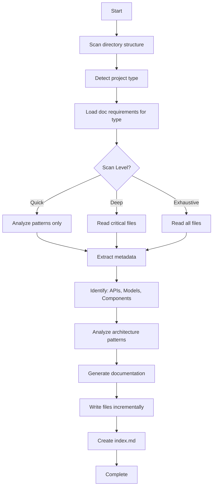

# שילוב במערכות קיימות (Brownfield Integration)

> **מדריך מקיף** לעבודה עם BMAD על פרויקטים קיימים - Brownfield Development

---

## 📋 תוכן עניינים

1. [מה זה Brownfield?](#מה-זה-brownfield)
2. [האתגרים של Brownfield](#האתגרים-של-brownfield)
3. [הגישה של BMAD](#הגישה-של-bmad)
4. [document-project - הלב של Brownfield](#document-project---הלב-של-brownfield)
5. [אסטרטגיות אינטגרציה](#אסטרטגיות-אינטגרציה)
6. [תרחישים נפוצים](#תרחישים-נפוצים)
7. [מעבר מGreenfield ל-Brownfield](#מעבר-מgreenfield-ל-brownfield)
8. [טיפים ותובנות](#טיפים-ותובנות)

---

## 🏗️ מה זה Brownfield?

### ההגדרה

**Brownfield Development** הוא פיתוח תוכנה על **קוד קיים**, בניגוד ל-**Greenfield** שהוא פיתוח מאפס.

**דוגמאות ל-Brownfield:**

```
✅ הוספת feature חדש לאפליקציה קיימת
✅ תיקון bug במערכת בת שנתיים
✅ רפקטורינג של מודול ישן
✅ שדרוג טכנולוגי של מערכת ישנה
✅ הוספת API endpoint לשירות קיים
✅ הכנסת צוות חדש לפרויקט פעיל
```

**למה זה שונה:**

| Greenfield | Brownfield |
|-----------|-----------|
| מתחילים מדף נקי | יש קוד קיים |
| בוחרים כל טכנולוגיה | טכנולוגיה כבר נבחרה |
| מגדירים conventions | צריך להתאים ל-conventions קיימים |
| אין legacy | יש legacy code |
| תיעוד חדש | תיעוד עלול להיות ישן/חסר |
| אין technical debt | יש technical debt |

### המציאות בשטח

**95% מהפיתוח בעולם הוא Brownfield!**

רוב המפתחים:
- מצטרפים לפרויקט פעיל
- מוסיפים features למערכת קיימת
- מתקנים bugs בקוד שלא כתבו
- משפרים ומשדרגים מערכות ישנות

**האתגר:** איך עושים את זה נכון עם AI ו-BMAD?

---

## ⚠️ האתגרים של Brownfield

### אתגר 1: חוסר הבנה של הקוד הקיים

**הבעיה:**
```
❌ אתם לא יודעים מה כל קובץ עושה
❌ לא ברור איך המערכת בנויה
❌ קשה למצוא איפה לשנות משהו
❌ פוחדים לשבור משהו
```

**ההשפעה על AI:**

כשאין תיעוד, AI agents:
- ממציאים assumptions שגויים
- מציעים פתרונות שלא מתאימים לארכיטקטורה
- כותבים קוד שלא עומד בconventions
- מפספסים components קיימים שאפשר לעשות בהם reuse

### אתגר 2: תיעוד לקוי או חסר

**הבעיה:**
```
❌ אין תיעוד בכלל
❌ יש README ישן מלפני שנה
❌ יש תיעוד ענק שאיש לא קורא
❌ התיעוד לא משקף את המציאות
```

**התוצאה:**
- זמן רב מבזבזים על הבנת הקוד
- טעויות בגלל הנחות שגויות
- קושי להכניס חברי צוות חדשים

### אתגר 3: Conventions לא ברורים

**הבעיה:**
```
❌ איזה naming conventions? איזה folder structure?
❌ איזה patterns משתמשים?
❌ איזה libraries מעדיפים?
❌ איך נראה code style?
```

**הסיכון:**

קוד חדש שלא מתאים לקוד הישן:
- קשה לתחזוקה
- יוצר inconsistency
- מבלבל את הצוות

### אתגר 4: Integration Points לא ברורים

**הבעיה:**
```
❌ איך לחבר קוד חדש לקוד ישן?
❌ אילו APIs קיימים אפשר להשתמש בהם?
❌ איזה data models יש?
❌ איך עובדת authentication?
```

**התוצאה:**
- רה-המצאת הגלגל (יש כבר, אבל לא ידעתם)
- שבירת אינטגרציות קיימות
- duplicate code

### אתגר 5: Technical Debt

**המציאות:**

כל קוד קיים יש לו:
- ⚠️ Code smells
- ⚠️ Workarounds זמניים שהפכו קבועים
- ⚠️ TODOs שנשכחו
- ⚠️ Dependencies ישנים
- ⚠️ Tests חסרים

**השאלה:**

האם להמשיך את הpatterns הישנים או לשפר?

---

## 🎯 הגישה של BMAD

### העקרון המנחה

> **"AI צריך להבין את הקוד הקיים לפני שהוא מתכנן שינויים"**

**הפתרון של BMAD:**

```
Step 1: תיעוד אוטומטי (document-project)
   ↓
Step 2: תכנון מבוסס הבנה (workflow-init + PRD/Tech-Spec)
   ↓
Step 3: פיתוח מושכל (Implementation עם context מלא)
```

### מה שונה ב-BMAD ל-Brownfield?

**Phase 0 חדשה: Documentation**

| Greenfield | Brownfield |
|-----------|-----------|
| אין Phase 0 | **יש Phase 0 - תיעוד!** |
| מתחילים ב-workflow-init | מתחילים ב-**document-project** |
| AI לא צריך context | AI **חייב** context |

**שאר הפאזות דומות, אבל:**

- Phase 2 (Planning): מתייחס לקוד קיים
- Phase 3 (Solutioning): משתלב עם ארכיטקטורה קיימת
- Phase 4 (Implementation): עוקב אחרי patterns קיימים

### הזרימה המלאה

```
Brownfield Project מתחיל? 
   ↓
[Phase 0] document-project
   ↓
   → מייצר docs/index.md
   → מייצר docs/architecture.md
   → מייצר docs/project-overview.md
   → AI מבין את המערכת!
   ↓
[Phase 1] workflow-init (מזהה Brownfield אוטומטית)
   ↓
[Phase 2] Planning (PRD/Tech-Spec מבוסס קוד קיים)
   ↓
[Phase 3] Solutioning (משתלב עם architecture קיים)
   ↓
[Phase 4] Implementation (עוקב אחרי conventions קיימים)
```

---

## 📚 document-project - הלב של Brownfield

### סקירה כללית

**document-project** הוא workflow שסורק את הקוד שלכם ויוצר תיעוד מקיף שמותאם ל-AI agents.

**מה הוא עושה:**

1. 🔍 **סורק את כל הפרויקט** - קבצים, תיקיות, מבנה
2. 🧠 **מזהה את הטכנולוגיות** - framework, language, database
3. 📐 **מנתח ארכיטקטורה** - patterns, components, structure
4. 📝 **מייצר תיעוד מובנה** - מותאם ל-AI
5. 💾 **שומר ב-docs/** - index.md + קבצים נוספים

### שלוש רמות סריקה

**Quick Scan (2-5 דקות):**
```
✅ מתאים ל: פרויקטים קטנים, מבנה ברור
❌ לא קורא קבצי קוד - רק מבנה
✅ מזהה: טכנולוגיות, מבנה כללי, entry points
```

**Deep Scan (10-30 דקות) - 🌟 מומלץ:**
```
✅ מתאים ל: רוב הפרויקטים
✅ קורא קבצים קריטיים (controllers, models, services)
✅ מזהה: patterns, APIs, data models, conventions
✅ יוצר תיעוד מקיף
```

**Exhaustive Scan (30-120 דקות):**
```
✅ מתאים ל: פרויקטים מורכבים, תיעוד חסר לחלוטין
✅ קורא את **כל** קבצי הקוד
✅ מזהה: הכל - כל פרט קטן
⚠️ לוקח זמן
```

### הפלטים (Outputs)

**document-project מייצר:**

```
docs/
├── index.md                      ⭐ Master entry point - התחל כאן
├── project-overview.md           📋 סיכום כללי
├── architecture.md               🏗️ מבנה המערכת
├── source-tree-analysis.md       📂 מבנה קבצים + הסברים
├── component-inventory.md        🧩 רשימת components (אם רלוונטי)
├── api-contracts.md              🔌 API endpoints (אם רלוונטי)
├── data-models.md                💾 Database schemas (אם רלוונטי)
├── development-guide.md          🛠️ איך לפתח
└── project-scan-report.json      🔧 State file (לresumability)
```

**הקובץ החשוב ביותר: `index.md`**

זהו ה-**entry point** לכל AI agent. הוא מכיל:
- סיכום המערכת
- Quick Reference
- קישורים לכל התיעוד
- הבנה מהירה

### איך להריץ

**שלב 1: טען אג'נט מתאים**

```
אג'נטים שיכולים להריץ document-project:
- Maya (Analyst)
- Paige (Technical Writer)
- BMad Master
```

**שלב 2: הפעל workflow**

```
בchat:
*document-project

או:
document-project

או (מתפריט):
בחר במספר המתאים מהתפריט
```

**שלב 3: ענה על שאלות**

האג'נט ישאל:
1. מה רמת הסריקה? (Quick/Deep/Exhaustive)
2. איזה תיקייה לסרוק? (ברירת מחדל: project root)
3. האם יש אזורים ספציפיים להתמקד בהם?

**שלב 4: המתן**

הworkflow רץ ומייצר את התיעוד.

**שלב 5: בדוק**

```
1. פתח: docs/index.md
2. קרא את הסקירה
3. ודא שהכל נכון
4. מוכן להמשיך!
```

### דוגמה - הרצה מלאה

```
User: *document-project

Analyst (Maya):
"I'll analyze your existing codebase and create comprehensive documentation 
optimized for AI-assisted development.

What scan level would you like?

1. Quick (2-5 min) - Structure and patterns only
2. Deep (10-30 min) - Critical files - **RECOMMENDED**
3. Exhaustive (30-120 min) - All source files

Your choice [1/2/3]:"

User: 2

Analyst:
"Starting Deep Scan...

Step 1/8: Detecting project type... ✅ Next.js 13 web application
Step 2/8: Analyzing structure... ✅ 47 files, 8 directories
Step 3/8: Reading critical files... ✅ 12 files analyzed
Step 4/8: Identifying patterns... ✅ App Router, Server Components
Step 5/8: Mapping APIs... ✅ 8 API routes documented
Step 6/8: Extracting data models... ✅ 5 models found
Step 7/8: Generating documentation... ✅ 7 files created
Step 8/8: Creating index... ✅ Complete

✅ Documentation Generated!

Files created:
- docs/index.md (master entry point)
- docs/project-overview.md
- docs/architecture.md
- docs/source-tree-analysis.md
- docs/component-inventory.md
- docs/api-contracts.md
- docs/data-models.md
- docs/development-guide.md

Next: Run workflow-init to start planning your changes."
```

### תכונות מתקדמות

#### 1. Resumability - המשך מאיפה שעצרת

אם הscan קופץ או עוצר באמצע:

```
User: *document-project

Analyst:
"I found an in-progress scan from 10 minutes ago.

Progress: 6/8 steps completed
Last step: Extracting data models

Would you like to:
1. Resume from where we left off
2. Start fresh
3. Cancel

Your choice [1/2/3]:"

User: 1

Analyst: "Resuming from step 7..."
```

**איך זה עובד:**

- כל שלב נשמר ב-`project-scan-report.json`
- אפשר לעצור ולהמשיך מאוחר יותר
- State נשמר עד 24 שעות

#### 2. Deep-Dive Mode - צלילה עמוקה

אם יש לכם תיעוד קיים אבל רוצים **צלילה עמוקה** לאזור ספציפי:

```
User: *document-project

Analyst:
"I found existing documentation from November 3rd.

What would you like to do?

1. Re-scan entire project
2. Deep-dive into specific area
3. Cancel

Your choice [1/2/3]:"

User: 2

Analyst: "What area would you like to deep-dive into?"

User: src/features/authentication

Analyst:
"Starting exhaustive deep-dive of authentication feature...

This will:
✅ Read ALL files in that folder
✅ Document every function, component, export
✅ Map all dependencies
✅ Trace data flow
✅ Identify patterns

Estimated time: 5-10 minutes

Continue? (y/n)"

User: y

Analyst:
"Deep-dive complete!

Generated: docs/deep-dive-authentication.md (8 pages)

Includes:
- Complete file inventory (15 files)
- All exports with signatures
- Dependency graph
- Data flow diagram
- Integration points
- Implementation guidance

This is now linked from docs/index.md"
```

**מתי משתמשים ב-Deep-Dive:**

✅ כשרוצים להוסיף feature לאזור מסוים
✅ כשצריכים refactoring ממוקד
✅ כשחוקרים bug באזור ספציפי
✅ כשרוצים להבין לעומק איך משהו עובד

#### 3. Multi-Part Projects

אם יש לכם פרויקט עם client + server:

```
document-project מזהה אוטומטית ויוצר:

docs/
├── index.md                         (master)
├── architecture-client.md           (client-specific)
├── architecture-server.md           (server-specific)
├── integration-architecture.md      (how they connect)
├── component-inventory-client.md    (UI components)
├── api-contracts-server.md          (API endpoints)
└── project-parts.json               (metadata)
```

### תהליך המחשבה של document-project

**מה האג'נט עושה מאחורי הקלעים:**



### Validation - איכות התיעוד

**document-project בודק את עצמו:**

אחרי כל קובץ שנכתב, הוא:
- ✅ מוודא שכל הsections מלאים
- ✅ בודק שאין placeholders
- ✅ מוודא שיש דוגמאות קוד אמיתיות
- ✅ בודק שכל הקישורים עובדים

**תוצאה:** תיעוד איכותי ואמין.

### טיפים לdocument-project

**טיפ 1: תמיד הריצו אותו תחילה**
```
❌ לא נכון:
   workflow-init על brownfield

✅ נכון:
   1. document-project
   2. workflow-init
```

**טיפ 2: Deep Scan זה ברירת המחדל הנכונה**
```
Quick = רק אם זה פרויקט קטן מאוד
Deep = רוב המקרים 👈 התחל כאן
Exhaustive = רק אם באמת צריך הכל
```

**טיפ 3: Deep-Dive לפני עבודה ממוקדת**
```
אם אתם עובדים רק על feature אחד:
1. Deep Scan כללי
2. Deep-Dive על הfeature הספציפי
→ תיעוד מושלם לאזור העבודה שלכם
```

**טיפ 4: תעדכנו מדי פעם**
```
הרצתם document-project לפני חודש?
עשיתם הרבה שינויים?
→ הריצו Re-scan לעדכן את התיעוד
```

**טיפ 5: chat חדש**
```
document-project יכול לקחת זמן
→ Chat חדש עם Analyst
→ תנו לו לרוץ עד הסוף
→ אל תשבשו באמצע עם workflows אחרים
```

---

## 🔄 אסטרטגיות אינטגרציה

### אסטרטגיה 1: תיעוד קודם כל

**העיקרון:**

> **"לעולם לא מתחילים לתכנן שינויים בלי להבין את המערכת הקיימת"**

**הזרימה:**

```
יום 1: document-project (Deep Scan)
   ↓
   docs/index.md מוכן
   ↓
יום 1-2: workflow-init + Planning
   ↓
   PRD/Tech-Spec מבוסס הבנה אמיתית
   ↓
יום 2+: Implementation
   ↓
   קוד שמשתלב חלק
```

**למה זה עובד:**

- AI מבין conventions
- AI מזהה integration points
- AI ממליץ על patterns קיימים
- אין surprises באמצע

### אסטרטגיה 2: תיעוד מדורג (Incremental Documentation)

**מתי:**

כשהפרויקט ענק ואין זמן לתעד הכל.

**איך:**

```
Stage 1: תיעוד Quick של כל הפרויקט
   ↓
   מבנה כללי + טכנולוגיות
   ↓
Stage 2: Deep-Dive על אזור העבודה הנוכחי
   ↓
   תיעוד מפורט של מה שאתם צריכים עכשיו
   ↓
Stage 3: תיעוד הדרגתי של שאר האזורים
   ↓
   ככל שעובדים, מוסיפים תיעוד
```

**יתרונות:**
- מתחילים מהר
- מתעדים רק מה שצריך
- תיעוד גדל עם הזמן

### אסטרטגיה 3: Documentation-First Development

**הרעיון:**

כל feature חדש מתחיל בתיעוד.

**הזרימה:**

```
Feature Request מגיע
   ↓
1. document-project על אזור רלוונטי (אם עוד לא)
   ↓
2. tech-spec/PRD עם context מלא
   ↓
3. Implementation
   ↓
4. עדכון תיעוד (אם השתנה משהו משמעותי)
```

**למה זה שווה:**

- כל feature מבוסס על הבנה עמוקה
- תיעוד תמיד עדכני
- צוות חדש יכול להצטרף בקלות

### אסטרטגיה 4: התאמה לPatterns קיימים

**השאלה:**

האם לעקוב אחרי patterns ישנים או ליצור חדשים?

**עץ החלטות:**

```
האם הpattern הישן בעייתי?
   ├─ לא → עקבו אחריו (consistency)
   │     אפילו אם זה לא ideal
   │
   └─ כן → האם זה בעיה קריטית?
         ├─ כן → תכננו refactoring מלא
         │     (BMad Method track עם Architecture)
         │
         └─ לא → עקבו אחריו בינתיים
               תעדו בTechnical Debt log
               תתקנו בעתיד
```

**דוגמה:**

```
תרחיש: הקוד הישן משתמש ב-REST, אתם מעדיפים GraphQL

❌ גישה שגויה:
   "בואו נוסיף GraphQL למערכת REST"
   → עכשיו יש שתי דרכים, confusion

✅ גישה נכונה - אופציה 1:
   "נמשיך עם REST כמו כל הקוד"
   → consistency

✅ גישה נכונה - אופציה 2:
   "נתכנן migration מלא לGraphQL"
   → PRD + Architecture + Migration plan
   → מיגרציה מתוכננת ומובנית
```

### אסטרטגיה 5: Feature Flags לשחרור הדרגתי

**מתי:**

כשמשנים משהו משמעותי בקוד קיים.

**איך:**

```typescript
// קוד ישן
function calculatePrice(item) {
  return item.price * 1.1; // old calculation
}

// קוד חדש עם feature flag
function calculatePrice(item) {
  if (featureFlags.newPricing) {
    return item.price * 1.15 + shippingCost; // new calculation
  }
  return item.price * 1.1; // old calculation (fallback)
}
```

**יתרונות:**

- אפשר לבדוק בproduction עם % מהמשתמשים
- אפשר לחזור אחורה מהר
- פחות סיכון
- rollout הדרגתי

### אסטרטגיה 6: Legacy Code Isolation

**הבעיה:**

יש קוד ישן שאף אחד לא רוצה לגעת בו.

**הפתרון:**

```
1. תעדו את הקוד הישן (document-project deep-dive)
   ↓
2. עטפו אותו ב-interface נקי
   ↓
3. כתבו קוד חדש מול הinterface
   ↓
4. בהדרגה - החליפו את המימוש הישן
```

**דוגמה:**

```javascript
// Legacy code (נשאר)
function oldUserAuth(username, password) {
  // 200 lines of spaghetti...
}

// Interface חדש
class AuthService {
  authenticate(credentials) {
    // בינתיים קורא ל-legacy
    return oldUserAuth(credentials.username, credentials.password);
  }
}

// קוד חדש משתמש בinterface
const authService = new AuthService();
authService.authenticate({username: 'user', password: 'pass'});

// בעתיד: מחליפים את המימוש בתוך AuthService
// הקוד החדש לא משתנה!
```

---

## 🎬 תרחישים נפוצים

### תרחיש 1: הוספת Feature לאפליקציה קיימת

**רקע:**
- יש לכם אפליקציית Next.js בת שנה
- צריך להוסיף "User Notifications" feature
- הקוד בלי תיעוד מסודר

**הזרימה המלאה:**

**שבוע 1 - יום ראשון (תיעוד):**

```
09:00 - Chat חדש עם Maya (Analyst)
User: "*document-project"

Maya: "Scan level? [1/2/3]"
User: "2" (Deep Scan)

[Maya רצה 25 דקות...]

Maya: 
"✅ Complete! Generated:
- docs/index.md
- docs/architecture.md
- docs/component-inventory.md
- docs/api-contracts.md
- docs/data-models.md

Findings:
- Next.js 14 App Router
- PostgreSQL + Prisma
- 32 components, 12 API routes
- Authentication: NextAuth.js
- Styling: Tailwind CSS

Ready for planning!"

09:30 - User קורא את docs/index.md
→ מבין את המבנה
→ רואה שיש Notification hooks כבר (!)
→ מזהה integration points
```

**שבוע 1 - יום ראשון-שני (תכנון):**

```
10:00 - Chat חדש עם John (PM)
User: "*workflow-init"

[John מזהה Brownfield, מוצא docs/]

John: "Found existing docs. Project type: Brownfield.
       Tell me about your work."

User: "Need to add user notifications - email + in-app"

John: "Scope assessment: ~10-15 stories. BMad Method track recommended."

[workflow-init creates workflow-status.yaml]

11:00 - Same chat
User: "*prd"

[John קורא את docs/index.md, architecture.md, api-contracts.md]

John: "I see you have:
- NextAuth for user sessions
- Prisma models
- Existing toast notifications (UI only)

I'll design notifications that integrate with these.

Let's discuss:
1. Notification types? (info/warning/error/success)
2. Triggers? (new message/comment/mention/etc.)
3. User preferences? (can users disable?)
4. Real-time? (polling/websockets/SSE?)
..."

[2 שעות של conversation]

John: "✅ PRD Complete!
- 4 Epics, 12 Stories
- Leverages existing: NextAuth, Prisma, toast system
- New: Notification model, preference system, email service
- Integration points clearly defined"
```

**שבוע 1 - יום שלישי (ארכיטקטורה):**

```
Chat חדש עם Winston (Architect)

User: "*create-architecture"

[Winston קורא PRD + docs/architecture.md]

Winston: "I'll extend your existing architecture.

Current:
- App Router structure
- API routes in /app/api/
- Server components + client components
- Prisma in /lib/prisma

Proposed additions:
- /lib/notifications/ (service layer)
- /app/api/notifications/ (API routes)
- Prisma schema extension
- /components/notifications/ (UI)
- Email service integration (Resend API)

This follows your existing patterns."

[Winston מייצר architecture.md מעודכן]

Winston: "✅ Architecture updated with notifications layer"
```

**שבוע 1 - יום רביעי (Gate Check):**

```
Chat חדש עם Winston

User: "*solutioning-gate-check"

Winston: [סורק PRD + Architecture + UX]

"✅ Gate Check PASSED

All epics covered in architecture
No conflicts found
Integration points clear
Ready for implementation!"
```

**שבוע 2-3 (פיתוח):**

```
יום א' - Chat חדש עם Marcus (SM)
User: "*sprint-planning"
→ sprint-status.yaml created

יום א' - Same chat
User: "*epic-tech-context" for Epic 1

יום ב' - Chat חדש עם Marcus
User: "*create-story" for Story 1
→ Story: "Create Notification model in Prisma schema"

יום ב' - Chat חדש עם Marcus
User: "*story-context" for Story 1

יום ב' - Chat חדש עם Amelia (DEV)
User: "*dev-story" for Story 1

[Amelia קוראת: Story-1.md, Story-1-context.md, architecture.md, docs/data-models.md]

Amelia: "I'll add the Notification model to your existing Prisma schema.

Current models: User, Post, Comment
I'll add: Notification, NotificationPreference

Following your naming conventions (camelCase for fields).
Using your existing patterns (createdAt, updatedAt fields)."

[Amelia כותבת קוד]

Amelia: "✅ Complete!
- prisma/schema.prisma updated
- Migration generated
- TypeScript types updated

Run: npx prisma migrate dev"

יום ב' - Chat חדש עם Amelia
User: "*code-review" for Story 1

Amelia: "Review complete:
✅ Schema follows conventions
✅ Indexes added for performance
✅ Relations properly defined
Minor: Add index on (userId, read, createdAt)

Fixed. Story 1 ready for merge!"
```

**תוצאה:**

- ✅ Feature מלא תוך שבועיים
- ✅ משתלב חלק עם קוד קיים
- ✅ איכות קוד גבוהה
- ✅ תיעוד מעודכן

**המפתח להצלחה:**

> document-project בהתחלה איפשר לכל האג'נטים להבין את המערכת ולהשתלב נכון

---

### תרחיש 2: רפקטורינג של מודול ישן

**רקע:**
- מודול Authentication בן 3 שנים
- קוד ספגטי, קשה לתחזוקה
- צריך לשפר בלי לשבור

**הזרימה:**

**Phase 0 - תיעוד עמוק:**

```
Chat עם Maya (Analyst)

User: "*document-project"

Maya: "Found existing docs from last month.
       What would you like?
       1. Re-scan
       2. Deep-dive
       3. Cancel"

User: "2"

Maya: "Which area?"

User: "src/auth/"

Maya: "Starting exhaustive deep-dive of auth module..."

[15 דקות...]

Maya: "✅ Deep-dive complete!

Generated: docs/deep-dive-auth.md (12 pages)

Findings:
- 18 files analyzed
- 47 functions documented
- Patterns: Mix of callbacks and async/await
- Issues found:
  * Password validation in 3 different places
  * Session logic duplicated
  * Error handling inconsistent
  * No tests for password reset

Integration points:
- Used by: /pages/api/*, /middleware/auth.js
- Dependencies: bcrypt, jsonwebtoken, Redis

Recommendations for refactoring:
1. Centralize validation
2. Extract SessionService
3. Standardize error handling
4. Add comprehensive tests"
```

**Phase 1-2 - תכנון Refactoring:**

```
Chat עם John (PM)

User: "*workflow-init"
→ Detects brownfield

User: "*prd"

[John קורא deep-dive-auth.md]

John: "I see the issues. This is a refactoring project.

Approach:
1. We'll refactor incrementally (not big-bang)
2. Maintain backward compatibility
3. Add tests first (safety net)
4. Refactor in stages

4 Epics:
1. Add comprehensive tests for current behavior
2. Extract services (SessionService, ValidationService)
3. Standardize error handling
4. Clean up and consolidate

Each epic = safe, tested step."
```

**Phase 3 - Architecture:**

```
Chat עם Winston (Architect)

User: "*create-architecture"

Winston: "Refactoring strategy:

Current:
src/auth/
├── login.js (mixed concerns)
├── register.js (mixed concerns)
├── reset.js (mixed concerns)
└── utils.js (god object)

Target:
src/auth/
├── services/
│   ├── AuthService.js
│   ├── SessionService.js
│   └── ValidationService.js
├── middleware/
│   └── authMiddleware.js
├── routes/
│   ├── login.js (thin controller)
│   ├── register.js (thin controller)
│   └── reset.js (thin controller)
└── tests/
    └── [comprehensive tests]

Migration:
- Week 1: Tests
- Week 2: Extract services (old code still works)
- Week 3: Migrate routes to use services
- Week 4: Remove old code

Zero downtime!"
```

**Phase 4 - Implementation:**

```
Implementation בשלבים:

Epic 1 (Tests): 5 stories
→ כתבו tests למצב הנוכחי
→ עכשיו יש safety net

Epic 2 (Services): 4 stories
→ יצרו services חדשים
→ הקוד הישן עדיין קיים

Epic 3 (Migration): 6 stories
→ route אחר route עובר לservices
→ tests עוברים = הכל עובד

Epic 4 (Cleanup): 2 stories
→ הסרת קוד ישן
→ תיעוד
```

**תוצאה:**

- ✅ refactoring בטוח, מבוקר
- ✅ אפס downtime
- ✅ קוד נקי ומתוחזק
- ✅ מלא tests

---

### תרחיש 3: צוות חדש מצטרף לפרויקט

**רקע:**
- 3 developers חדשים מצטרפים
- פרויקט בן שנתיים
- צריך onboarding מהיר

**יום 1 - תיעוד:**

```
Tech Lead מריץ:

Chat עם Maya
Tech Lead: "*document-project"
→ Deep Scan
→ 20 דקות

Maya: "✅ Documentation ready!"
```

**יום 1-2 - למידה עצמאית:**

```
הDevelopers החדשים:

1. קוראים docs/index.md
   → מבינים מבנה כללי
   
2. קוראים docs/architecture.md
   → מבינים איך הכל חיבר
   
3. קוראים docs/development-guide.md
   → מריצים את הפרויקט מקומית
   
4. קוראים docs/component-inventory.md
   → רואים מה כבר קיים

אחרי יום: יודעים 70% מהפרויקט
```

**יום 3 - תרגול:**

```
Developer 1 מקבל story קטן: "Fix validation bug"

Chat עם Amelia (DEV)
Dev: "Story 23 - fix email validation in registration"

[Amelia קוראת docs/ + Story-23.md]

Amelia: "I see the issue. Based on your codebase:
- Validation is in /lib/validation.js
- Used by /app/api/register/route.js
- Pattern: Zod schemas

The bug: email regex too restrictive.

Fix:" 

[Amelia מציגה פתרון שמתאים לpatterns הקיימים]

Dev: "This makes sense! I understand the codebase structure now."
```

**יום 4-5 - אוטונומיה:**

```
הDevelopers כבר:
✅ מבינים מבנה הפרויקט
✅ יודעים איפה מה
✅ עוקבים אחרי conventions
✅ עובדים בצורה עצמאית
```

**השוואה:**

```
❌ בלי BMAD:
Onboarding: 2-4 שבועות
הרבה שאלות, confusion
טעויות בגלל אי-הבנה

✅ עם BMAD:
Onboarding: 3-5 ימים
למידה עצמאית מהתיעוד
תרומה מהירה
```

---

### תרחיש 4: Migration טכנולוגי

**רקע:**
- אפליקציה React 16 + Redux
- רוצים לעבור ל-React 18 + Zustand
- פרויקט גדול, לא אפשר big-bang

**Phase 0 - תיעוד מצב נוכחי:**

```
Chat עם Maya

User: "*document-project"
→ Exhaustive scan (כי צריך הכל)
→ 45 דקות

Maya: "✅ Complete!

Current state:
- React 16.14
- Redux + Redux-Saga
- 89 components
- 12 Redux modules
- Heavy use of class components

This documentation will be your migration baseline."
```

**Phase 1-2 - תכנון Migration:**

```
Chat עם John (PM)

User: "*workflow-init"
User: "*prd"

John: "This is a major migration. Enterprise Method track.

Strategy: Incremental migration over 3 months

Phase 1: React 18 (2 weeks)
- Update React + testing
- Fix breaking changes
- No Redux changes yet

Phase 2: Zustand adoption (6 weeks)
- Add Zustand alongside Redux
- Migrate store by store
- Both systems coexist

Phase 3: Redux removal (2 weeks)
- Remove Redux dependencies
- Cleanup

Phase 4: Component modernization (2 weeks)
- Class → Function components
- Hooks adoption

40+ stories across 4 phases"
```

**Phase 3 - Architecture:**

```
Chat עם Winston (Architect)

User: "*create-architecture"

Winston: "Migration architecture:

Week 1-2: React 18
/src/... (no structure changes)
- Update dependencies
- Fix lifecycle methods
- Test thoroughly

Week 3-8: Zustand Integration
/src/store/ (new)
├── redux/ (old, stays temporarily)
└── zustand/ (new)
    ├── userStore.js
    ├── cartStore.js
    └── ...

Components use both:
import { useSelector } from 'redux'; // old
import { useUserStore } from 'zustand'; // new

Migration per store:
1. Create Zustand equivalent
2. Update components one-by-one
3. Remove Redux module when unused

Week 9-10: Cleanup
Remove /src/store/redux/
Update all imports

Week 11-12: Modernization
Convert class components gradually"
```

**Phase 4 - Implementation:**

```
Sprint 1-2: React 18
→ Stories: Update React, fix tests, fix deprecations

Sprint 3-8: Zustand Migration  
→ Epic 1: User Store migration (3 stories)
→ Epic 2: Cart Store migration (4 stories)
→ Epic 3: Products Store migration (5 stories)
→ ... (each store = separate epic)

Sprint 9-10: Redux Removal
→ Stories: Remove dependencies, cleanup

Sprint 11-12: Component Modernization
→ Stories: Convert class components
```

**הדרך:**

```
✅ תיעוד מלא לפני = baseline
✅ תכנון incremental = בטוח
✅ coexistence זמנית = zero downtime
✅ migration הדרגתי = ניתן לבקרה
✅ tests לכל שלב = ביטחון
```

**תוצאה:**

- ✅ migration מוצלח תוך 3 חודשים
- ✅ אפס downtime בproduction
- ✅ צוות למד טכנולוגיות חדשות
- ✅ קוד מודרני ונקי

---

### תרחיש 5: Bug קריטי בקוד ישן

**רקע:**
- בag קריטי בייצור
- קורה במודול שאף אחד לא מכיר
- צריך תיקון **מהיר**

**דקה 0-30: הבנה מהירה:**

```
Chat עם Maya (Analyst)

Tech Lead: "*document-project"

Maya: "Quick scan or deep-dive?"

Tech Lead: "Deep-dive on src/payment/"

Maya: "Starting exhaustive scan of payment module..."

[10 דקות]

Maya: "✅ Deep-dive ready!

docs/deep-dive-payment.md

Critical findings:
- 8 files, 23 functions
- Main flow: checkout.js → processPayment() → chargeCard()
- Integration: Stripe API v2 (old!)
- Error handling: try-catch but logs swallowed
- Issue spotted: Webhook signature not validated properly

This could be your bug!"
```

**דקה 30-60: תכנון תיקון:**

```
Chat עם John (PM)

Tech Lead: "*tech-spec" (Quick Flow, זה hotfix)

John: [קורא deep-dive-payment.md]

"Bug: Webhook signatures not validated
Impact: Security + payment confirmation failures

Fix approach:
1. Add signature validation (Stripe library)
2. Add logging for webhook events
3. Add error notifications
4. Add tests

1 Epic, 3 Stories (4 hours work)"
```

**שעה 1-5: תיקון מהיר:**

```
Chat עם Amelia (DEV)

Tech Lead: "*dev-story" for Story 1

[Amelia קוראת deep-dive-payment.md + tech-spec.md]

Amelia: "I understand the payment flow.

Current code:
```javascript
app.post('/webhook', async (req, res) => {
  const event = req.body; // ❌ No validation!
  await handleEvent(event);
  res.send(200);
});
```

Fixed code:
```javascript
app.post('/webhook', async (req, res) => {
  const sig = req.headers['stripe-signature'];
  
  try {
    // ✅ Validate signature
    const event = stripe.webhooks.constructEvent(
      req.body, 
      sig, 
      process.env.STRIPE_WEBHOOK_SECRET
    );
    
    await handleEvent(event);
    logger.info('Webhook processed', { eventId: event.id });
    res.send(200);
  } catch (err) {
    logger.error('Webhook error', { error: err.message });
    res.status(400).send(`Webhook Error: ${err.message}`);
  }
});
```

Test added, ready for review."

[Code review, deploy]

✅ Bug fixed in 5 hours
```

**למה זה עבד מהר:**

- 📚 Deep-dive איפשר הבנה מהירה (10 דקות במקום שעות)
- 🎯 Tech-spec ממוקד (לא PRD מלא)
- 💻 DEV agent הבין את הקוד מהתיעוד
- ✅ תיקון מדויק ובטוח

---

## 💡 טיפים ותובנות

### טיפ 1: document-project זה ביטוח

**למה:**
```
השקעה: 10-30 דקות
חיסכון: שעות/ימים של confusion

אפילו אם אתם מכירים את הקוד
→ האג'נטים לא!
```

### טיפ 2: העדיפו Deep Scan

**למה:**
```
Quick: רק מבנה (לא מספיק לרוב המקרים)
Deep: מבנה + patterns + conventions ✅
Exhaustive: הכל (רק אם באמת צריך)

Deep = sweet spot
```

### טיפ 3: תעדכנו תיעוד תקופתי

**מתי לעדכן:**
```
✅ עשיתם refactoring גדול
✅ הוספתם מודול חדש
✅ שינית ארכיטקטורה
✅ עבר חודש מהתיעוד האחרון

הריצו Re-scan → תיעוד עדכני
```

### טיפ 4: Deep-Dive לפי צורך

**מתי:**
```
✅ עובדים על feature ספציפי
✅ צריכים להבין מודול מורכב
✅ מתכננים refactoring
✅ יש bug באזור ספציפי

Deep-dive → תיעוד ברמת קובץ/פונקציה
```

### טיפ 5: תיעוד = אונבורדינג

**אם יש צוות:**
```
Developer חדש?
→ תנו לו את docs/index.md
→ יום למידה עצמאית
→ מוכן לעבודה

במקום:
→ שבוע של shadowing
→ המון שאלות
→ טעויות
```

### טיפ 6: תיעוד כבסיס לConversations

**תבנית:**
```
כשמדברים עם אג'נטים:

"קרא את docs/index.md ו-docs/architecture.md
לפני שנתחיל"

→ האג'נט מקבל context מלא
→ התשובות יותר טובות
→ פחות הזיות
```

### טיפ 7: Legacy Code? תעדו ותבודדו

**אסטרטגיה:**
```
1. document-project deep-dive על הlegacy
2. הבינו מה הוא עושה
3. עטפו בinterface
4. כתבו חדש מול הinterface
5. החליפו הדרגתי
```

### טיפ 8: Multi-Part? תעדו בנפרד

**אם יש client + server:**
```
document-project מזהה ויוצר:
- architecture-client.md
- architecture-server.md
- integration-architecture.md

→ מאפשר עבודה מקבילית
→ ברור מה משתלב איפה
```

### טיפ 9: Feature Flags לשינויים גדולים

**למה:**
```
משנים משהו משמעותי?
→ Feature flag
→ rollout הדרגתי
→ אפשר לחזור אחורה
→ פחות סיכון
```

### טיפ 10: תיעוד טוב = תכנון טוב

**המשוואה:**
```
תיעוד איכותי
   ↓
AI agents מבינים את המערכת
   ↓
PRD/Tech-Spec מדויקים
   ↓
Implementation חלק
   ↓
קוד איכותי שמשתלב נכון
```

---

## 🎓 מעבר מGreenfield ל-Brownfield

### מה משתנה?

**בGreenfield (פרויקט חדש):**
```
workflow-init → PRD → Architecture → Implementation
```

**בBrownfield (פרויקט קיים):**
```
document-project → workflow-init → PRD → Architecture → Implementation
             ↑
      השלב החדש!
```

### Checklist למעבר

```
□ יש לי קוד קיים? → זה Brownfield
□ הרצתי document-project? → חובה!
□ docs/index.md קיים? → בדוק שהוא עדכני
□ workflow-init זיהה Brownfield? → אמור לקרות אוטומטית
□ האג'נטים קוראים את docs/? → תמיד תזכיר להם
□ הקוד החדש מתאים לישן? → code-review יבדוק
```

### טעויות נפוצות

**טעות 1: לדלג על document-project**
```
❌ "יש לי קוד קטן, לא צריך"
✅ גם קוד קטן צריך תיעוד ל-AI
```

**טעות 2: Quick Scan לפרויקט מורכב**
```
❌ "Quick כדי לחסוך זמן"
✅ Deep יחסוך יותר זמן בהמשך
```

**טעות 3: לא לעדכן תיעוד**
```
❌ תיעדתם לפני חודש, המשיכו הלאה
✅ Re-scan אם היו שינויים משמעותיים
```

**טעות 4: לא להזכיר לאג'נטים**
```
❌ מצפים שהאג'נט יזכור מעצמו
✅ "קרא את docs/index.md קודם"
```

---

## 📊 סיכום והמלצות

### העקרונות המרכזיים

1. **תיעוד תחילה** - document-project לפני הכל
2. **הבנה לפני תכנון** - AI צריך context
3. **Deep Scan כברירת מחדל** - המתוק ביותר
4. **תיעוד מתעדכן** - לא "כתוב ושכח"
5. **תיעוד = אונבורדינג** - חדשים לומדים מהר

### הזרימה הנכונה

```
Brownfield Project?
   ↓
1. document-project (Deep Scan)
   ↓
2. קרא ובדוק docs/index.md
   ↓
3. workflow-init (מזהה brownfield אוטומטית)
   ↓
4. PRD/Tech-Spec (מבוסס קוד קיים)
   ↓
5. Architecture (משתלב עם קיים)
   ↓
6. Implementation (עוקב אחרי patterns)
   ↓
7. עדכן תיעוד אם צריך
```

### מתי להריץ document-project?

```
✅ תמיד: בהתחלת עבודה על קוד קיים
✅ לפני: workflow-init על brownfield
✅ כש: צוות חדש מצטרף
✅ אחרי: שינויים משמעותיים (refactoring, modules חדשים)
✅ כל: חודש-חודשיים (תחזוקה)
```

### השוואת זמנים

| תרחיש | בלי BMAD | עם BMAD (+ document-project) |
|-------|---------|------------------------------|
| הוספת feature | 2-4 שבועות | 1-2 שבועות |
| Refactoring | 1-2 חודשים | 2-3 שבועות |
| Bug fix קריטי | 1-2 ימים | 4-6 שעות |
| Onboarding | 2-4 שבועות | 3-5 ימים |
| Migration | 4-6 חודשים | 2-3 חודשים |

### המפתח להצלחה

> **"תיעוד אוטומטי + תכנון מבוסס הבנה = פיתוח מהיר ובטוח"**

---

## 🔗 קישורים ומשאבים

### מדריכים רלוונטיים

- 📖 [מדריך התחלה מהירה](./00-התחלה-מהירה-לכולם.md)
- 📖 [מילון מונחים](./01-מילון-מונחים-מלא.md)
- 📖 [מדריך workflows](./03-workflows-part-1a-intro-critical.md)
- 📖 [שיטות עבודה מומלצות](./05-שיטות-עבודה-מומלצות.md)

### מקורות נוספים

- 🌐 [Brownfield Guide (English)](../bmm/docs/brownfield-guide.md)
- 🌐 [document-project Workflow](../bmm/workflows/document-project/)
- 💬 [Discord Community](https://discord.gg/gk8jAdXWmj)
- 🐛 [GitHub Issues](https://github.com/bmad-code-org/BMAD-METHOD/issues)

---

<div dir="rtl" align="center">

**נוצר עבור קהילת BMAD-METHOD**

*מדריך זה מבוסס על ניסיון מעשי עם מאות פרויקטי Brownfield*

**יש לכם success stories? שתפו בDiscord!**

📅 *עדכון אחרון: נובמבר 2024*

</div>