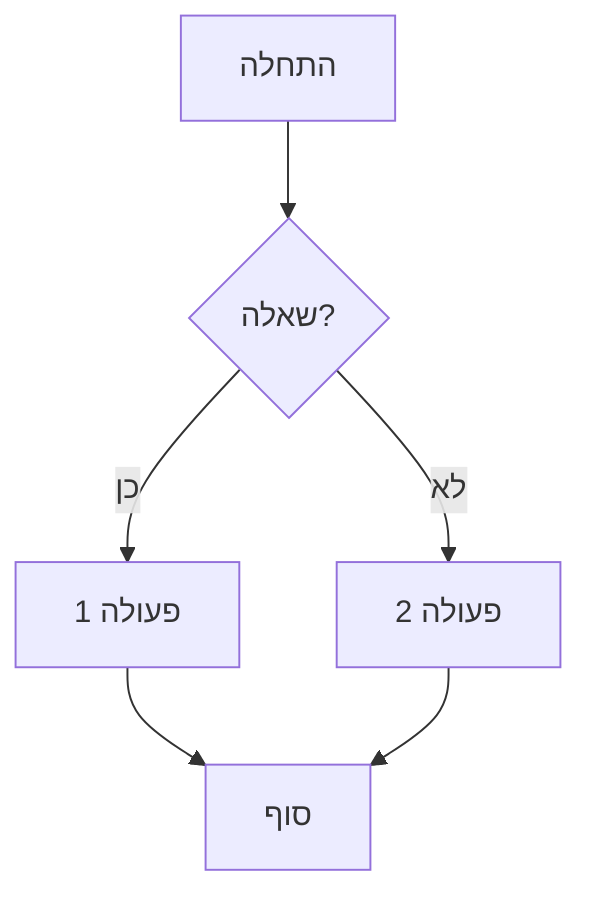

# עזרים ויזואליים ל-BMAD-METHOD

> **מדריך מרכזי** לכל הדיאגרמות, התרשימים והעזרים הויזואליים

---

## 📊 מה יש בתיקייה הזו?

תיקייה זו מיועדת להכיל עזרים ויזואליים שיעזרו לכם ללמוד ולהבין את BMAD-METHOD:

### 🎨 סוגי עזרים מתוכננים:

1. **דיאגרמות ארכיטקטורה** - איך BMAD בנוי ועובד
2. **תרשימי זרימה** - מסלולי עבודה והחלטות
3. **עצי החלטה** - איזה אג'נט/וורקפלואו להשתמש
4. **מפות קשרים** - איך האג'נטים עובדים ביחד
5. **אינפוגרפיקה** - מידע מורכב בצורה ויזואלית
6. **Infographics בעברית** - תיוויים ותוכן בעברית

---

## 🚀 עזרים ויזואליים מומלצים

### 1. מפת המודולים והאג'נטים

**מטרה:** להבין את המבנה הכללי של BMAD

```
┌─────────────────────────────────────────┐
│         BMAD-METHOD v6                  │
│                                         │
│  ┌─────────┐  ┌─────────┐  ┌────────┐ │
│  │ BMad    │  │  BMad   │  │  CIS   │ │
│  │ CORE    │  │ Method  │  │        │ │
│  │         │  │ (BMM)   │  │        │ │
│  │ 1 Agent │  │12 Agents│  │5 Agents│ │
│  └─────────┘  └─────────┘  └────────┘ │
│                                         │
│  ┌─────────┐  ┌─────────────────────┐ │
│  │ BMad    │  │  + Custom Modules   │ │
│  │ Builder │  │                     │ │
│  │ (BMB)   │  │  יצירת פתרונות      │ │
│  │ 1 Agent │  │  מותאמים אישית      │ │
│  └─────────┘  └─────────────────────┘ │
└─────────────────────────────────────────┘
```

---

### 2. תרשים זרימה - בחירת מסלול (Track Selection)

```
האם אתם מתחילים פרויקט חדש?
              │
              ▼
    ┌─────────────────────┐
    │  הריצו workflow-init │
    └─────────────────────┘
              │
              ▼
    ┌────────────────────────────┐
    │ תארו את הפרויקט שלכם       │
    │ (גודל, מורכבות, סוג)      │
    └────────────────────────────┘
              │
        ┌─────┴─────┐
        ▼           ▼
    ┌────────┐  ┌─────────┐
    │ Bug Fix│  │ Product │
    │ קטן    │  │ גדול    │
    └────────┘  └─────────┘
        │           │
        ▼           ▼
    ┌────────┐  ┌─────────┐
    │ Quick  │  │ BMad    │
    │ Flow   │  │ Method  │
    └────────┘  └─────────┘
```

---

### 3. מפת 4 הפאזות (Four Phases)

```
┌──────────────────────────────────────────────┐
│         Phase 0: Documentation               │
│         (רק Brownfield - פרויקט קיים)       │
│         • document-project                   │
└──────────────────────────────────────────────┘
                    │
                    ▼
┌──────────────────────────────────────────────┐
│         Phase 1: Analysis (אופציונלי)       │
│         • brainstorm-project                 │
│         • research                           │
│         • product-brief                      │
└──────────────────────────────────────────────┘
                    │
                    ▼
┌──────────────────────────────────────────────┐
│         Phase 2: Planning (חובה!)           │
│         • prd (Level 2+)                     │
│         • tech-spec (Level 0-1)              │
│         • create-ux-design (אופציונלי)      │
└──────────────────────────────────────────────┘
                    │
                    ▼
┌──────────────────────────────────────────────┐
│         Phase 3: Solutioning                 │
│         (רק Level 2+)                        │
│         • architecture                       │
│         • solutioning-gate-check             │
└──────────────────────────────────────────────┘
                    │
                    ▼
┌──────────────────────────────────────────────┐
│         Phase 4: Implementation (חובה!)     │
│         • sprint-planning                    │
│         • create-story                       │
│         • dev-story                          │
│         • code-review                        │
│         • retrospective                      │
└──────────────────────────────────────────────┘
```

---

### 4. עץ החלטה - איזה אג'נט להשתמש?

```
                  מה אני רוצה לעשות?
                          │
          ┌───────────────┼───────────────┐
          ▼               ▼               ▼
      תכנון           פיתוח          בדיקות
          │               │               │
    ┌─────┴─────┐    ┌────┴────┐         │
    ▼           ▼    ▼         ▼         ▼
  PM/         Architect  DEV    SM       TEA
  Analyst     Winston    Amelia  Bob     Murat
  
  PRD/Brief   תכנון      קוד   Stories  טסטים
              טכני       בפועל  ניהול   איכות
```

---

### 5. מחזור חיים של Story

```
   ┌──────────┐
   │ BACKLOG  │ ← כל ה-Stories מתחילים כאן
   └────┬─────┘
        │
        ▼
   ┌──────────┐
   │ DRAFTED  │ ← SM יוצר Story מפורט
   └────┬─────┘
        │
        ▼
   ┌──────────┐
   │  READY   │ ← Story מוכן לפיתוח
   └────┬─────┘
        │
        ▼
   ┌──────────┐
   │IN PROGRESS│ ← DEV עובד על ה-Story
   └────┬─────┘
        │
        ▼
   ┌──────────┐
   │  REVIEW  │ ← Code Review
   └────┬─────┘
        │
        ▼
   ┌──────────┐
   │   DONE   │ ← הושלם! ✅
   └──────────┘
```

---

### 6. מטריצת בחירת מסלול (Track Selection Matrix)

```
                       פשוט    בינוני   מורכב   ארגוני
                        │        │        │        │
    Bug Fix / תיקון    │ Quick  │        │        │
                        │ Flow   │        │        │
    ────────────────────┼────────┼────────┼────────┼────
    תכונה קטנה          │ Quick  │        │        │
                        │ Flow   │        │        │
    ────────────────────┼────────┼────────┼────────┼────
    מוצר / פלטפורמה     │        │ BMad   │ BMad   │
                        │        │ Method │ Method │
    ────────────────────┼────────┼────────┼────────┼────
    מערכת ארגונית       │        │        │        │Enterprise
                        │        │        │        │ Method
    ────────────────────┴────────┴────────┴────────┴────
                      
    משך תכנון:         שעות    1-2 ימים 2-4 ימים שבוע
```

---

### 7. מפת האג'נטים לפי תפקידים

#### מפתחים 💻
```
[PM] ──┬── [Architect] ──┬── [DEV]
       │                 │
       └── [SM] ─────────┴── [TEA]
```

#### מנהלי מוצר 📊
```
[Analyst] ──┬── [PM] ──┬── [UX Designer]
            │          │
            └──────────┴── [Tech Writer]
```

#### יצירתיים 🎨
```
[Brainstorming Coach] ──┬── [Design Thinking]
                        │
[Innovation Strategist] ─┴── [Storyteller]
```

---

## 📁 תכנון עתידי של קבצים

הקבצים הבאים מתוכננים להתווסף בעתיד:

### דיאגרמות (PNG/SVG):

- `bmad-architecture.png` - ארכיטקטורת המערכת
- `workflow-flowchart.png` - תרשים זרימה מלא
- `agent-relationships.png` - קשרים בין אג'נטים
- `phase-progression.png` - התקדמות בפאזות
- `track-decision-tree.png` - עץ החלטה למסלולים
- `story-lifecycle.png` - מחזור חיים של Story

### אינפוגרפיקה (PNG/SVG):

- `bmad-in-3-minutes.png` - BMAD ב-3 דקות
- `quick-start-visual.png` - התחלה מהירה ויזואלית
- `common-workflows.png` - וורקפלואים נפוצים
- `agent-selector.png` - בוחר אג'נטים
- `success-checklist.png` - צ'קליסט הצלחה

---

## 🎨 איך להשתמש בעזרים?

### לצפייה מהירה:
- פתחו את הקבצים ישירות ב-GitHub או ב-IDE
- הדפיסו אותם ותלו ליד העמדה

### לשיתוף:
- צרפו לפרזנטציות
- שתפו עם הצוות
- השתמשו בהדרכות

### ללמידה:
- הדפיסו את התרשימים החשובים
- צרו "מפת דרכים" אישית
- סמנו איפה אתם נמצאים

---

## 💡 טיפים ליצירת עזרים משלכם

אם אתם רוצים ליצור תרשימים משלכם:

### כלים מומלצים:

1. **Draw.io** (חינמי) - https://app.diagrams.net
2. **Mermaid** (בתוך Markdown) - תחביר טקסטואלי
3. **Figma** (עיצוב מקצועי)
4. **Excalidraw** (מהיר וידידותי)

### תבניות שימושיות:



---

## 📚 משאבים נוספים

### מדריכים קשורים:

- [מילון מונחים](../01-מילון-מונחים-מלא.md) - הסברים טקסטואליים
- [מדריך אג'נטים](../02-מדריך-אגנטים-מקיף.md) - פירוט מלא
- [מדריך וורקפלואים](../03-מדריך-וורקפלואים-מקיף.md) - רשימה מלאה

### תיעוד רשמי:

- [BMAD README](../../README.md) - תיעוד המערכת
- [BMM Docs](../../bmm/docs/) - מסמכי BMM
- [Quick Start](../../bmm/docs/quick-start.md) - מדריך מהיר

---

## 🤝 תרומה

רוצים לתרום עזרים ויזואליים?

1. צרו תרשים או דיאגרמה
2. שמרו בפורמט PNG/SVG
3. תייגו בעברית
4. שלחו Pull Request!

**כל תרומה מתקבלת בברכה! 🎉**

---

## 💬 זקוקים לעזרה?

- **Discord**: https://discord.gg/gk8jAdXWmj
- **GitHub Issues**: https://github.com/bmad-code-org/BMAD-METHOD/issues

---

<div dir="rtl" align="center">

*חזרו למדריך הראשי: [README.md](../README.md)*

**תמונה שווה אלף מילים! 🎨**

</div>

