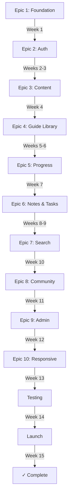

# Agenseek - Story Dependency Matrix

**Purpose:** Visual map of dependencies between all 66 stories  
**Critical Path:** Stories that block multiple other stories  
**Use:** Identify blockers and plan parallel work opportunities  

---

## Dependency Visualization

### Legend
- 🔴 **Blocker** - Blocks multiple epics or critical features
- 🟡 **Critical** - Blocks entire epic
- 🟢 **Standard** - Blocks next story in sequence
- 🔵 **Optional** - Can be deferred without blocking

---

## Critical Path (Sequential - Cannot be parallelized)



---

## Epic-Level Dependencies

| Epic | Depends On | Blocks | Can Start When | Must Complete Before |
|------|-----------|--------|----------------|---------------------|
| Epic 1 | None | All other epics | Immediately | Sprint 1 end |
| Epic 2 | Epic 1 | All protected features | Sprint 2 start | Sprint 3 end |
| Epic 3 | Epic 2 | All content display | Sprint 4 start | Sprint 4 end |
| Epic 4 | Epic 3 | Progress tracking, achievements | Sprint 5 start | Sprint 6 end |
| Epic 5 | Epic 4 | Dashboard features | Sprint 7 start | Sprint 7 end |
| Epic 6 | Epic 5 | Search (notes/tasks) | Sprint 8 start | Sprint 9 end |
| Epic 7 | Epic 6 | None (enhancement) | Sprint 10 start | Sprint 10 end |
| Epic 8 | Epic 7 | None (enhancement) | Sprint 11 start | Sprint 11 end |
| Epic 9 | Epic 8 | None (admin only) | Sprint 12 start | Sprint 12 end |
| Epic 10 | Epic 9 | Launch | Sprint 13 start | Sprint 13 end |

---

## Story-Level Dependency Matrix

### Epic 1: Foundation (All stories are blockers)

| Story | Depends On | Blocks | Type | Notes |
|-------|-----------|--------|------|-------|
| 1.1 | None | ALL | 🔴 Blocker | First story, blocks everything |
| 1.2 | 1.1 | 1.3+ | 🔴 Blocker | Tailwind required for all styling |
| 1.3 | 1.2 | 1.4+ | 🔴 Blocker | Shadcn/ui components used everywhere |
| 1.4 | 1.3 | 1.6+ | 🟡 Critical | Dependencies for state, routing, etc. |
| 1.5 | 1.1 | 1.6, all data stories | 🔴 Blocker | Database blocks all data operations |
| 1.6 | 1.5 | 1.7, 2.x | 🔴 Blocker | Auth client blocks authentication |
| 1.7 | 1.6 | 1.8, all pages | 🔴 Blocker | Routing blocks all page navigation |
| 1.8 | 1.7 | All protected pages | 🟡 Critical | Layout required for page structure |
| 1.9 | 1.8 | Deployment | 🟢 Standard | Deployment config |
| 1.10 | 1.9 | Development workflow | 🟢 Standard | Code quality tools |

### Epic 2: Authentication & Onboarding

| Story | Depends On | Blocks | Type | Notes |
|-------|-----------|--------|------|-------|
| 2.1 | Epic 1 | 2.2 | 🟡 Critical | Login page blocks registration flow |
| 2.2 | 2.1 | 2.3 | 🟡 Critical | Registration creates users |
| 2.3 | 2.2 | 2.4 | 🟢 Standard | Password reset for existing users |
| 2.4 | 2.3 | 2.5 | 🔵 Optional | Google OAuth is optional |
| 2.5 | 2.4 | 2.6 | 🟡 Critical | Onboarding wizard start |
| 2.6 | 2.5 | 2.7 | 🟡 Critical | Role selection for personalization |
| 2.7 | 2.6 | 2.8 | 🟡 Critical | Interests for personalization |
| 2.8 | 2.7 | 2.9 | 🟡 Critical | Experience level for personalization |
| 2.9 | 2.8 | 2.10 | 🟡 Critical | Learning path generation |
| 2.10 | 2.9 | Epic 3+ | 🔴 Blocker | Protected routes block all features |

### Epic 3: Dynamic Content Rendering

| Story | Depends On | Blocks | Type | Notes |
|-------|-----------|--------|------|-------|
| 3.1 | Epic 2 | 3.2 | 🔴 Blocker | Type definitions for all content |
| 3.2 | 3.1 | 3.3+ | 🔴 Blocker | ContentRenderer blocks content display |
| 3.3 | 3.2 | 3.4 | 🟡 Critical | Core blocks required |
| 3.4 | 3.3 | 3.5 | 🟡 Critical | Code blocks common in guides |
| 3.5 | 3.4 | 3.6 | 🟡 Critical | Callouts used heavily |
| 3.6 | 3.5 | 3.7 | 🟢 Standard | Tables less common |
| 3.7 | 3.6 | 3.8 | 🟢 Standard | Accordions for long content |
| 3.8 | 3.7 | 3.9 | 🟢 Standard | Tabs for organized content |
| 3.9 | 3.8 | 3.10 | 🔵 Optional | Charts nice to have |
| 3.10 | 3.9 | Epic 4 | 🔵 Optional | Grid/Card/Image/Video enhancement |

### Epic 4: Guide Library & Discovery

| Story | Depends On | Blocks | Type | Notes |
|-------|-----------|--------|------|-------|
| 4.1 | Epic 3 | 4.2 | 🟡 Critical | Catalog required for guide metadata |
| 4.2 | 4.1 | 4.3 | 🟡 Critical | Sample guides needed for testing |
| 4.3 | 4.2 | 4.4 | 🟡 Critical | Guide cards for library |
| 4.4 | 4.3 | 4.5 | 🟡 Critical | Library page for browsing |
| 4.5 | 4.4 | 4.6 | 🔴 Blocker | Guide reader blocks progress tracking |
| 4.6 | 4.5 | 4.7, 5.x | 🔴 Blocker | Progress tracking blocks achievements |
| 4.7 | 4.6 | Epic 5 | 🟡 Critical | Mark complete for achievement system |
| 4.8 | 4.7 | None | 🔵 Optional | Navigation enhancement |

### Epic 5: Progress Tracking & Achievements

| Story | Depends On | Blocks | Type | Notes |
|-------|-----------|--------|------|-------|
| 5.1 | Epic 4 | 5.2 | 🟡 Critical | Dashboard structure |
| 5.2 | 5.1 | 5.3 | 🟡 Critical | Progress for badge system |
| 5.3 | 5.2 | 5.4 | 🟡 Critical | Achievements for motivation |
| 5.4 | 5.3 | 5.5 | 🟢 Standard | Continue reading section |
| 5.5 | 5.4 | 5.6 | 🟢 Standard | Activity feed |
| 5.6 | 5.5 | 5.7 | 🟢 Standard | Statistics widgets |
| 5.7 | 5.6 | 5.8 | 🔵 Optional | Popular guides widget |
| 5.8 | 5.7 | Epic 6 | 🔵 Optional | Full progress page |

### Epic 6: Personal Learning Workspace

| Story | Depends On | Blocks | Type | Notes |
|-------|-----------|--------|------|-------|
| 6.1 | Epic 5 | 6.2 | 🟡 Critical | Note editor for notes feature |
| 6.2 | 6.1 | 6.3 | 🟡 Critical | Notes library for management |
| 6.3 | 6.2 | 6.4 | 🟢 Standard | Quick note enhancement |
| 6.4 | 6.3 | 6.5 | 🟡 Critical | Task management structure |
| 6.5 | 6.4 | 6.6 | 🟡 Critical | Task creation modal |
| 6.6 | 6.5 | 6.7 | 🟡 Critical | Kanban board for tasks |
| 6.7 | 6.6 | 6.8 | 🟢 Standard | Quick task enhancement |
| 6.8 | 6.7 | Epic 7 | 🔵 Optional | Statistics for notes/tasks |

### Epic 7: Global Search & Command Palette

| Story | Depends On | Blocks | Type | Notes |
|-------|-----------|--------|------|-------|
| 7.1 | Epic 6 | 7.2 | 🟡 Critical | Search infrastructure for all search |
| 7.2 | 7.1 | 7.3 | 🟡 Critical | Header search for quick access |
| 7.3 | 7.2 | 7.4 | 🟢 Standard | Search results page |
| 7.4 | 7.3 | 7.5 | 🟡 Critical | Command palette for power users |
| 7.5 | 7.4 | Epic 8 | 🔵 Optional | Keyboard shortcuts enhancement |

### Epic 8: Community Features

| Story | Depends On | Blocks | Type | Notes |
|-------|-----------|--------|------|-------|
| 8.1 | Epic 7 | 8.2 | 🟡 Critical | Comment system structure |
| 8.2 | 8.1 | 8.3 | 🟡 Critical | Comment form for posting |
| 8.3 | 8.2 | 8.4 | 🟡 Critical | Voting for helpful comments |
| 8.4 | 8.3 | 8.5 | 🟡 Critical | Q&A functionality |
| 8.5 | 8.4 | 8.6 | 🟢 Standard | Edit/delete for management |
| 8.6 | 8.5 | Epic 9 | 🔵 Optional | Notifications enhancement |

### Epic 9: Admin Analytics & Management

| Story | Depends On | Blocks | Type | Notes |
|-------|-----------|--------|------|-------|
| 9.1 | Epic 8 | 9.2 | 🟡 Critical | Admin dashboard overview |
| 9.2 | 9.1 | 9.3 | 🟡 Critical | User management for admins |
| 9.3 | 9.2 | 9.4 | 🟡 Critical | Content analytics |
| 9.4 | 9.3 | 9.5 | 🟡 Critical | Engagement reports |
| 9.5 | 9.4 | 9.6 | 🔵 Optional | Admin notifications |
| 9.6 | 9.5 | Epic 10 | 🔵 Optional | Action log for audit |

### Epic 10: Responsive Design & Accessibility

| Story | Depends On | Blocks | Type | Notes |
|-------|-----------|--------|------|-------|
| 10.1 | Epic 9 | 10.2 | 🟡 Critical | Mobile navigation for all pages |
| 10.2 | 10.1 | 10.3 | 🟡 Critical | Guide reader mobile optimization |
| 10.3 | 10.2 | 10.4 | 🔴 Blocker | Accessibility compliance required |
| 10.4 | 10.3 | 10.5 | 🔴 Blocker | Performance optimization required |
| 10.5 | 10.4 | Launch | 🔴 Blocker | Responsive layouts for launch |

---

## Blocker Stories Summary

These stories block the most other stories and should be prioritized:

### Tier 1 Blockers (Block Everything)

| Story | Description | Blocks | Sprint |
|-------|-------------|--------|--------|
| 1.1 | Initialize Vite + React + TypeScript | All 65 stories | Sprint 1 |
| 1.5 | Create Supabase Database | All data operations (~50 stories) | Sprint 1 |
| 1.6 | Set Up Supabase Client | All authenticated features (~55 stories) | Sprint 1 |
| 1.7 | Configure Routing | All pages (~50 stories) | Sprint 1 |
| 2.10 | Protected Routes Logic | All protected features (~50 stories) | Sprint 3 |

### Tier 2 Blockers (Block Epic+)

| Story | Description | Blocks | Sprint |
|-------|-------------|--------|--------|
| 3.1 | Content Block Type Definitions | All content rendering (~40 stories) | Sprint 4 |
| 3.2 | Content Renderer Orchestrator | All content display (~40 stories) | Sprint 4 |
| 4.5 | Guide Reader 3-Panel Layout | Progress tracking, achievements (~30 stories) | Sprint 6 |
| 4.6 | Progress Tracking | Dashboard, achievements (~25 stories) | Sprint 6 |
| 10.3 | Accessibility Compliance | Launch (blocker) | Sprint 13 |
| 10.4 | Performance Optimization | Launch (blocker) | Sprint 13 |

---

## Cross-Epic Dependencies

### Database Schema (1.5) → Data Stories

All stories that read/write data depend on 1.5:

- Epic 2: All auth and profile stories (2.1-2.10)
- Epic 4: Progress tracking (4.6-4.7)
- Epic 5: All dashboard stories (5.1-5.8)
- Epic 6: Notes and tasks (6.1-6.8)
- Epic 8: Comments (8.1-8.6)
- Epic 9: Analytics (9.1-9.6)

### Authentication (2.10) → Protected Features

All protected pages depend on 2.10:

- Epic 4: Guide library and reader (4.4-4.8)
- Epic 5: Dashboard (5.1-5.8)
- Epic 6: Notes and tasks (6.1-6.8)
- Epic 7: Search (7.1-7.5)
- Epic 8: Comments (8.1-8.6)
- Epic 9: Admin (9.1-9.6)

### Content Renderer (3.2) → Content Display

All content display depends on 3.2:

- Epic 4: Guide reader (4.5)
- Epic 6: Rich text notes (6.1)
- Epic 8: Comment markdown (8.2)

### Progress Tracking (4.6) → Achievements

Achievement system depends on progress data:

- Epic 5: Achievement badges (5.3)
- Epic 5: Statistics (5.6)
- Epic 5: Progress details (5.8)

---

## Parallel Work Opportunities

### Within Sprint 1 (if multiple devs)
- Group A: 1.1 → 1.2 → 1.3 → 1.4 (UI stack)
- Group B: 1.1 → 1.5 (Database setup, can start after 1.1)
- Converge: 1.6 needs both groups complete

### Within Sprint 4 (Content blocks)
After 3.2 complete, these can be parallelized:
- 3.3-3.4 (Core blocks + Code)
- 3.5-3.6 (Callout + Table)
- 3.7-3.8 (Accordion + Tabs)
- 3.9-3.10 (Chart + Remaining - both P1, can defer)

### Within Sprint 7 (Dashboard widgets)
After 5.2 complete, these can be parallelized:
- 5.4-5.5 (Continue Reading + Activity)
- 5.6-5.7 (Statistics + Popular Guides)

### Within Sprint 13 (Responsive)
After 10.1-10.2 complete, these can be parallelized:
- 10.3 (Accessibility audit)
- 10.4 (Performance audit)
- 10.5 (Layout refinements)

---

## Risk Mitigation: Dependency Risks

### Risk 1: Database Schema Changes
**Impact:** If schema changes after Epic 1, affects 50+ stories  
**Mitigation:** Thoroughly review schema in 1.5, align with product brief, get sign-off before Epic 2

### Risk 2: Content Type Changes
**Impact:** If content types change after Epic 3, affects 40+ stories  
**Mitigation:** Finalize content schema in 3.1 with sample guides (4.2), test all block types before Epic 5

### Risk 3: Auth Flow Changes
**Impact:** If auth changes after Epic 2, affects 50+ stories  
**Mitigation:** Complete auth testing in Sprint 3, don't proceed to Epic 3 until auth is solid

### Risk 4: Performance Issues Late
**Impact:** Discovering performance issues in Sprint 14 (testing)  
**Mitigation:** Monitor performance in Sprints 6, 9, 12 (after major features), optimize proactively

---

## Dependency Enforcement

### Pre-Story Checklist

Before starting any story, verify:

1. ✅ All prerequisite stories are complete
2. ✅ No blockers exist (database, auth, routing, etc.)
3. ✅ Required dependencies are installed
4. ✅ Test data exists if needed

### Post-Story Verification

After completing any blocker story (🔴):

1. ✅ Run full regression tests
2. ✅ Verify dependent stories can start
3. ✅ Update dependency tracking
4. ✅ Communicate completion to team

---

## Dependency Graph by Sprint

### Sprint 1 (Epic 1)
```
1.1 (start)
 ├─→ 1.2 → 1.3 → 1.4 (linear chain)
 └─→ 1.5 → 1.6 → 1.7 → 1.8 → 1.9 → 1.10 (main chain)
```

### Sprint 2-3 (Epic 2)
```
2.1 → 2.2 → 2.3 → 2.4 → 2.5 → 2.6 → 2.7 → 2.8 → 2.9 → 2.10
(strictly sequential, personalization flow)
```

### Sprint 4 (Epic 3)
```
3.1 → 3.2 → 3.3 → 3.4 → 3.5 → 3.6 → 3.7 → 3.8 → 3.9 → 3.10
(sequential, but 3.9-3.10 can be deferred)
```

### Sprint 5-6 (Epic 4)
```
4.1 → 4.2 → 4.3 → 4.4 → 4.5 → 4.6 → 4.7 → 4.8
(sequential, reading experience flow)
```

### Sprint 7 (Epic 5)
```
5.1 → 5.2 → 5.3 (critical path)
         ├─→ 5.4 → 5.5 (can parallelize after 5.3)
         └─→ 5.6 → 5.7 → 5.8 (can parallelize after 5.3)
```

### Sprint 8-9 (Epic 6)
```
6.1 → 6.2 → 6.3 (notes chain)
6.4 → 6.5 → 6.6 → 6.7 (tasks chain, depends on 6.3)
6.8 (depends on both chains)
```

### Sprint 10 (Epic 7)
```
7.1 → 7.2 → 7.3 → 7.4 → 7.5
(sequential, search experience flow)
```

### Sprint 11 (Epic 8)
```
8.1 → 8.2 → 8.3 → 8.4 → 8.5 → 8.6
(sequential, community features flow)
```

### Sprint 12 (Epic 9)
```
9.1 → 9.2 → 9.3 → 9.4 → 9.5 → 9.6
(sequential, admin tools flow)
```

### Sprint 13 (Epic 10)
```
10.1 → 10.2 (mobile optimization)
         ├─→ 10.3 (accessibility - can parallelize after 10.2)
         ├─→ 10.4 (performance - can parallelize after 10.2)
         └─→ 10.5 (layouts - depends on 10.3 + 10.4)
```

---

## Summary Statistics

- **Total Stories:** 66
- **Tier 1 Blockers:** 5 stories (block 50+ stories each)
- **Tier 2 Blockers:** 6 stories (block 25+ stories each)
- **Critical Path Stories:** 40 stories (must be sequential)
- **Parallelizable Stories:** 26 stories (can be done in parallel if multiple devs)
- **Optional Stories:** 10 stories (P1-P3 priority, can be deferred)

**Minimum Completion Time:** 13 weeks (if everything goes perfectly and stories are worked sequentially)  
**Planned Duration:** 15 weeks (includes 2 weeks buffer for testing and launch)

---

**Document Version:** 1.0  
**Date:** November 6, 2025  
**Author:** Bob (Scrum Master)  
**Status:** Complete dependency analysis

